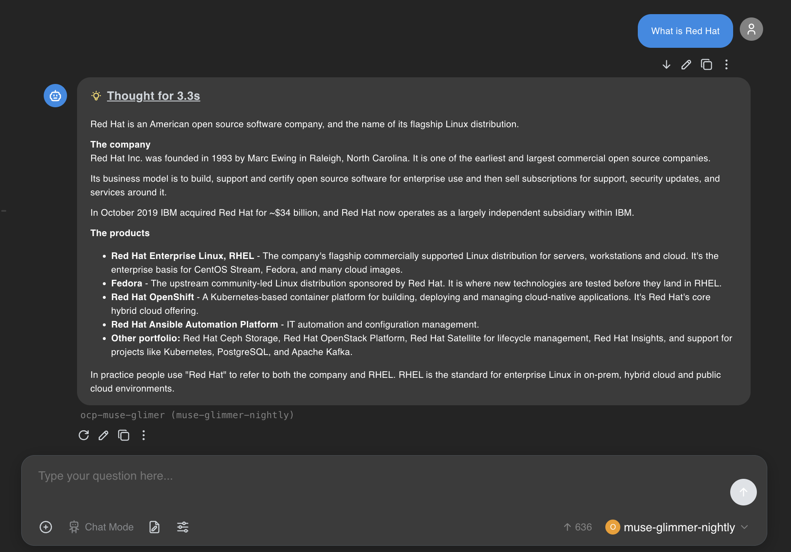

# Upstream vLLM Nightly ServingRuntime for Muse Glimmer 30B

This directory contains a custom `ServingRuntime` for serving [Muse Glimmer 30B](https://huggingface.co/RedHatAI/Muse-Glimmer-30B-NVFP4) (`meta-models/Muse-Glimmer-30B`) on Red Hat OpenShift AI (RHOAI) using an **upstream vLLM nightly image**.

> **Not covered by Red Hat support.** This is a custom runtime for piloting/evaluating a brand-new model architecture ahead of RHOAI bundling it.

## Testing

**OpenShift AI 3.4.3**

Chat completions working against the deployed model:

