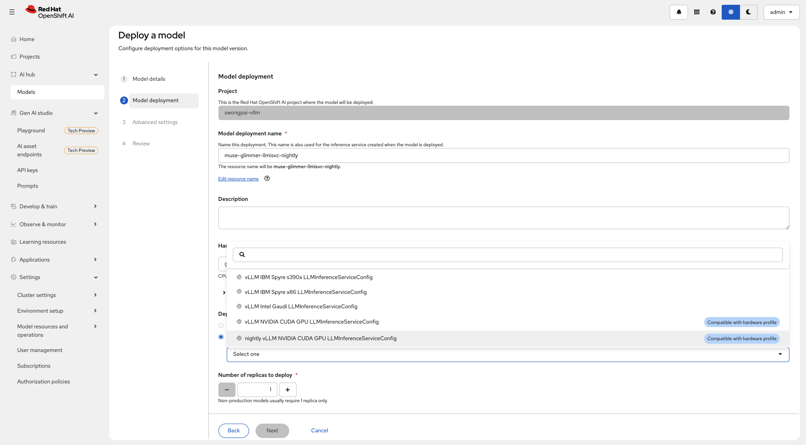
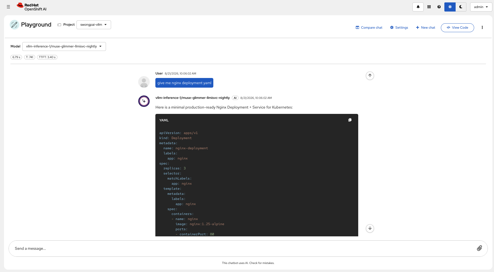
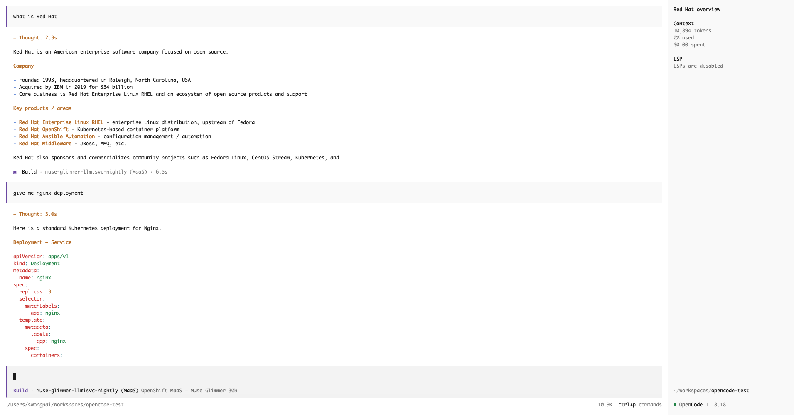
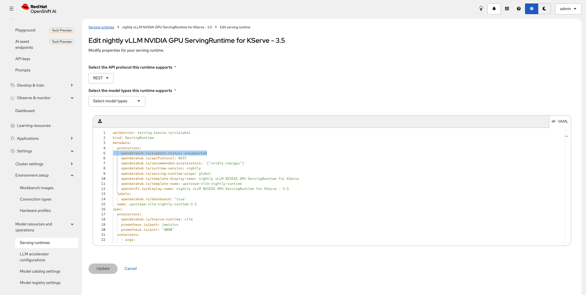
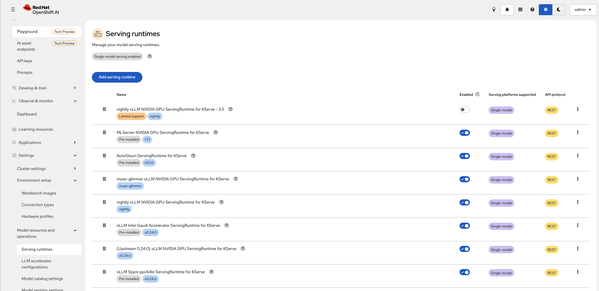
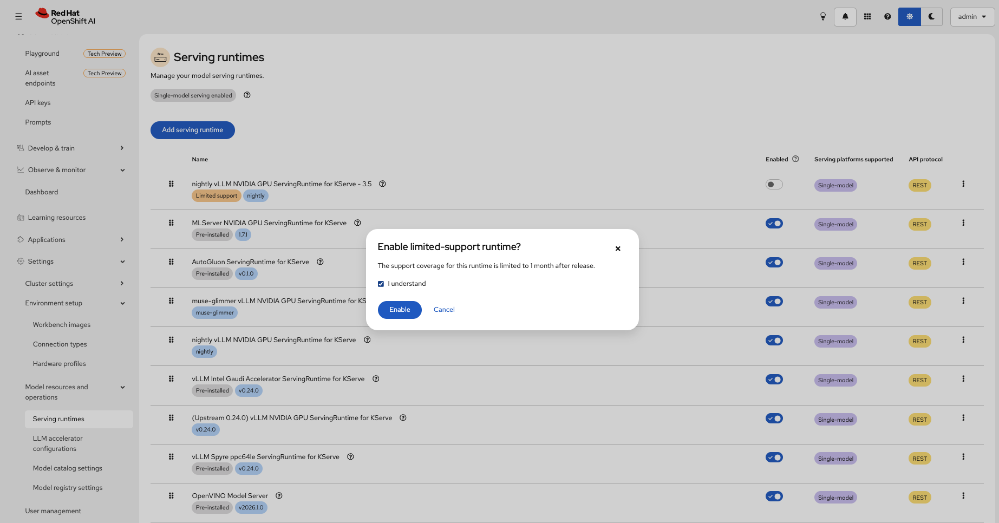
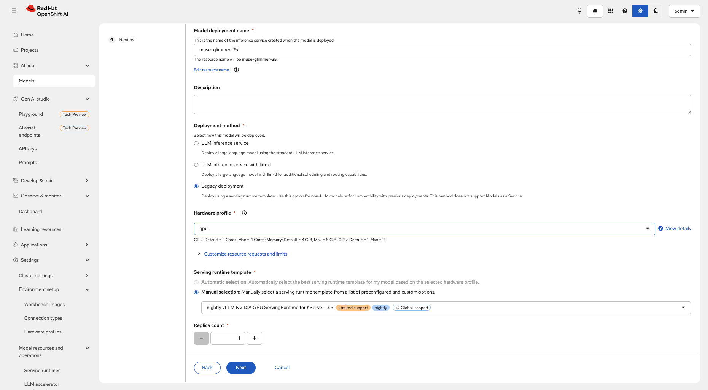
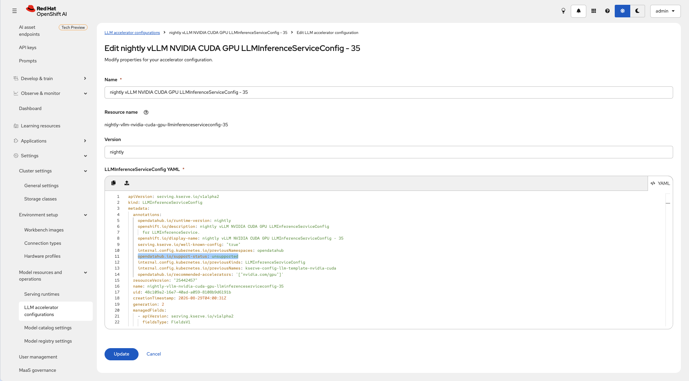
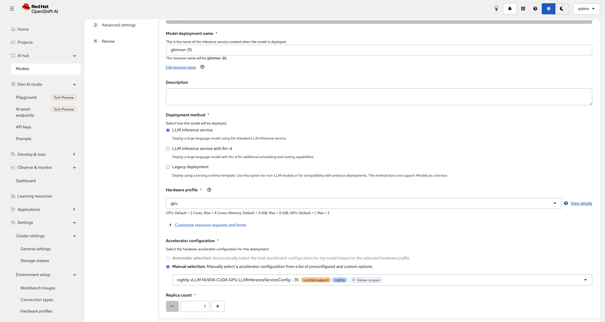

# Upstream vLLM Nightly ServingRuntime for Muse Glimmer 30B

Created: 2026-08-21
Last Modified: 2026-08-25

This directory contains a complete set of resources for serving [Muse Glimmer 30B NVFP4](https://huggingface.co/RedHatAI/Muse-Glimmer-30B-NVFP4) on Red Hat OpenShift AI (RHOAI) using an **upstream vLLM nightly image**.

> **Not covered by Red Hat support.** This is a custom runtime for piloting/evaluating a brand-new model architecture ahead of RHOAI bundling it.

## Why a Nightly Image

Muse Glimmer uses the `muse_glimmer` tool-call and reasoning parser, which is only available in vLLM nightly builds as of August 2026. No stable vLLM release includes this parser yet, so a nightly image is the only option.

## Files in This Directory

This example demonstrates two deployment approaches for the same model, each with its own set of resources.

### Approach 1 -- Traditional InferenceService (ServingRuntime + InferenceService)

- **`servingruntime.yaml`** -- Defines the custom `ServingRuntime` resource. This is the "runtime template" that tells OpenShift AI how to run vLLM: which container image to pull (`vllm/vllm-openai:nightly`), the entrypoint command (`vllm serve`), environment variables for OpenShift UID compatibility, and default GPU tuning parameters. It gets registered cluster-wide and appears in the serving runtime dropdown in the dashboard.

- **`inferenceservice.yaml`** -- A standard KServe `InferenceService` that actually deploys the model. It references the custom `ServingRuntime` by name (`runtime: muse-glimmer-nightly`), points to the model weights on a PVC (`pvc://muse-30b-nvfp4/Muse-Glimmer-30B-NVFP4`), and adds Muse-Glimmer-specific vLLM args (`--tool-call-parser=muse_glimmer`, `--reasoning-parser=muse_glimmer`). This is the same pattern used in the Gemma 4 example.

### Approach 2 -- LLMInferenceService (MaaS / Gateway path)

- **`llminferenceserviceconfig.yaml`** -- A `LLMInferenceServiceConfig` resource that registers the vLLM nightly image as an available "serving configuration" for the newer `LLMInferenceService` API. Think of it as the MaaS equivalent of a `ServingRuntime` -- it tells the platform which container image to use when deploying models through the MaaS gateway. The file contains two documents: a cluster-scoped template (applied to `redhat-ods-applications`) and the auto-generated namespace-scoped config.

- **`llminferenceservice.yaml`** -- The `LLMInferenceService` resource that deploys the model through the Models-as-a-Service (MaaS) gateway. Compared to the traditional `InferenceService`, it has a simpler spec and provides built-in routing via a gateway reference (`maas-default-gateway`). The model-specific vLLM args are passed through the `VLLM_ADDITIONAL_ARGS` environment variable instead of the `args` field.

## Testing - ServingRuntime + InferenceService

**OpenShift AI 3.4.3**

Chat completions working against the deployed model:

## Testing - LLMInferenceServiceConfig + LLMInferenceService

**OpenShift AI 3.4.3**

Testing the model deployed via `LLMInferenceService` through the Models-as-a-Service (MaaS) gateway playground:

Testing tool-calling with OpenCode against the MaaS-exposed endpoint:

**OpenShift AI 3.5.0 update**

Add annotation for unlimited support runtime.

Similar for LLMinferenceserviceconfig

